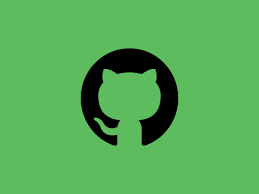

# :🧑‍💻 Bayisa Daba

**`Full Stack Web Developer (React, nextjs,nodejs,express,php,Django, Mysql,postgresql)`**

I'm a Software Engineering Student. 

  ---

 

### 🧰 Languages and framework

 
<!-- profile -->
#

### 📊 Stats

### 🔥 My GitHub Streak

#

  

  

  

## 📫 Let's Connect

  
  
  
  

  

 

